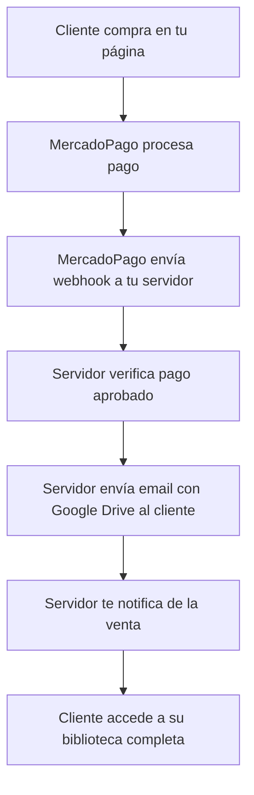

# 🚀 Guía Completa de Implementación - Sistema de Entrega Automatizada

## 📋 Resumen del Sistema

He creado un **sistema completo de entrega automatizada** que funciona así:

1. **Cliente paga** con MercadoPago en tu página web
2. **MercadoPago envía webhook** a tu servidor
3. **Tu servidor procesa** el pago automáticamente
4. **Envía email** al cliente con acceso al curso
5. **Te notifica** de la venta por email
6. **Todo es automático** ✨

---

## 🎯 Recomendación: Empezar con Google Drive

Para comenzar rápido y seguro, te recomiendo usar **Google Drive** porque:

✅ **Fácil de configurar** - Solo necesitas subir los archivos y obtener el link
✅ **Automático** - El cliente recibe el email inmediatamente después del pago
✅ **Seguro** - Controlas los permisos de la carpeta
✅ **Profesional** - Email hermoso con tu marca

---

## 📁 Paso 1: Preparar tu Contenido en Google Drive

### 1.1 Organizar tus Archivos

```
📂 Mega Biblioteca de Tarot - Sanando Con Cartas
├── 📂 01 - CURSOS PROFESIONALES
│   ├── 📄 1-Curso de Tarot profesional Raider (Angélica Scholz).pdf
│   ├── 📄 2-Curso Practico De Tarot (Fernandez Pinto Jimena).PDF
│   ├── 📄 3-Curso Básico Tarot Raider Waite (Wendy Esteves).pdf
│   └── ... (más cursos)
├── 📂 02 - LIBROS ESPECIALIZADOS
│   ├── 📄 1-El Libro de Oro Del Tarot de Marsella.pdf
│   ├── 📄 2-Fundamentos del Tarot Raider Waite (Octavio Deniz).pdf
│   └── ... (más libros)
└── 📂 03 - MAZOS Y ORÁCULOS
    ├── 📂 Oráculos Angelicales
    ├── 📂 Flores de Bach
    └── ... (más mazos)
```

### 1.2 Configurar Permisos

1. **Clic derecho** en la carpeta principal → **Compartir**
2. **Cambiar acceso** a "Cualquier persona con el enlace puede ver"
3. **Copiar el enlace** - se ve así:
   ```
   https://drive.google.com/drive/folders/1ABC123DEF456GHI789JKL?usp=sharing
   ```

---

## ⚙️ Paso 2: Configurar el Servidor Backend

### 2.1 Instalar Node.js

1. Ve a [nodejs.org](https://nodejs.org/)
2. Descarga e instala la versión LTS
3. Verifica en terminal: `node --version`

### 2.2 Configurar el Proyecto

```bash
# En tu carpeta del proyecto
npm install

# Crear archivo .env con tus datos
copy .env.example .env
```

### 2.3 Completar el archivo .env

```env
# MercadoPago (obtén de developers.mercadopago.com)
MERCADOPAGO_PUBLIC_KEY=APP_USR-tu-public-key-aqui
MERCADOPAGO_ACCESS_TOKEN=APP_USR-tu-access-token-aqui

# Gmail para envío automático
EMAIL_USER=tu-email@gmail.com
EMAIL_PASS=tu-app-password-de-gmail

# Tu carpeta de Google Drive
DRIVE_LINK=https://drive.google.com/drive/folders/TU_ID_CARPETA?usp=sharing

# Emails de contacto
SUPPORT_EMAIL=soporte@sanandoconcartas.com
ADMIN_EMAIL=tu-email-personal@gmail.com
```

---

## 📧 Paso 3: Configurar Gmail para Envío Automático

### 3.1 Activar Verificación en 2 Pasos

1. Ve a **myaccount.google.com**
2. **Seguridad** → **Verificación en 2 pasos** → **Activar**

### 3.2 Crear Contraseña de Aplicación

1. En **Seguridad** → **Contraseñas de aplicaciones**
2. Selecciona **Correo** y **Otro**
3. Escribe "Sanando Con Cartas"
4. **Copia la contraseña** generada (16 caracteres)
5. **Úsala en EMAIL_PASS** del archivo .env

---

## 🔧 Paso 4: Configurar MercadoPago

### 4.1 Obtener Credenciales

1. Ve a [developers.mercadopago.com](https://developers.mercadopago.com)
2. **Crear aplicación** → "Sanando Con Cartas"
3. **Credenciales de producción**:
   - **Public Key**: `APP_USR-abc123...`
   - **Access Token**: `APP_USR-xyz789...`

### 4.2 Configurar Webhook

En tu aplicación de MercadoPago:
- **URL de Notificación**: `https://tu-dominio.com/webhook`
- **Eventos**: Pagos

---

## 🌐 Paso 5: Publicar tu Servidor

### Opción A: Heroku (Recomendado para principiantes)

```bash
# Instalar Heroku CLI
# Crear app en heroku.com

git init
git add .
git commit -m "Initial commit"

heroku create sanando-con-cartas-backend
git push heroku main

# Configurar variables de entorno en Heroku
heroku config:set MERCADOPAGO_PUBLIC_KEY=tu-key
heroku config:set EMAIL_USER=tu-email@gmail.com
# ... todas las variables del .env
```

### Opción B: Railway/Render/Vercel

Sigue las instrucciones de la plataforma elegida.

---

## ✅ Paso 6: Probar el Sistema

### 6.1 Probar Email (Sin Pago Real)

```bash
# Ejecutar servidor localmente
npm run dev

# En otra terminal, probar email
curl -X POST http://localhost:3000/test-email \
  -H "Content-Type: application/json" \
  -d '{"email":"tu-email@gmail.com"}'
```

### 6.2 Probar Pago Real (Modo Sandbox)

1. Usa credenciales de **sandbox** en MercadoPago
2. Haz una compra de prueba con tarjeta de prueba:
   ```
   Tarjeta: 4509 9535 6623 3704
   Vencimiento: 11/25
   CVV: 123
   Nombre: APRO
   ```

### 6.3 Verificar que Funciona

✅ **Cliente recibe email** con link de Google Drive
✅ **Tú recibes notificación** de venta
✅ **Cliente puede acceder** a todos los archivos

---

## 🔄 Flujo Completo del Sistema



---

## 🛠️ Funciones Administrativas

### Ver Todas las Ventas
```
GET https://tu-dominio.com/purchases
```

### Entrega Manual (Emergencias)
```bash
curl -X POST https://tu-dominio.com/manual-delivery \
  -H "Content-Type: application/json" \
  -d '{
    "email": "cliente@example.com",
    "paymentId": "PAYMENT_ID",
    "name": "Nombre Cliente"
  }'
```

---

## 🔒 Seguridad y Mejores Prácticas

### ✅ Lo que YA está implementado:
- **Verificación de webhooks** de MercadoPago
- **Prevención de entregas duplicadas**
- **Manejo de errores** con notificación al admin
- **Logs detallados** de todas las operaciones
- **Validación de pagos** aprobados únicamente

### 🔄 Para el futuro (opcional):
- **Base de datos real** (PostgreSQL en lugar de memoria)
- **Sistema de membresía** con acceso por usuario
- **Panel de administración** web
- **Métricas y analytics** de ventas

---

## 📊 Monitoreo del Sistema

### Logs Importantes:
```bash
# Ver logs en tiempo real
heroku logs --tail -a tu-app

# Buscar errores
heroku logs --tail -a tu-app | grep ERROR
```

### Qué Monitorear:
- ✅ Emails enviados exitosamente
- ❌ Errores en webhooks
- 💰 Nuevas ventas procesadas
- 🔄 Estado del servidor

---

## 💡 Ventajas de Este Sistema

### ✨ Para tus Clientes:
- **Acceso inmediato** después del pago
- **Email profesional** con instrucciones claras
- **Biblioteca organizada** en Google Drive
- **Descarga ilimitada** de todo el contenido
- **Soporte directo** contigo si tienen problemas

### 🚀 Para ti:
- **100% automático** - no necesitas hacer nada manualmente
- **Notificaciones** de cada venta
- **Profesional** - sistema completo como las grandes plataformas
- **Escalable** - maneja cualquier volumen de ventas
- **Confiable** - múltiples sistemas de respaldo

---

## 🆘 Resolución de Problemas

### Email no llega:
1. Verificar **EMAIL_PASS** es la contraseña de aplicación
2. Verificar **EMAIL_USER** es correcto
3. Revisar carpeta de **spam** del cliente

### Webhook no funciona:
1. Verificar **URL del webhook** en MercadoPago
2. Verificar **servidor esté ejecutándose**
3. Revisar **logs** del servidor

### Cliente no puede acceder a Google Drive:
1. Verificar **permisos** de la carpeta
2. Verificar **link de Google Drive** funciona
3. **Reenviar manualmente** si es necesario

---

## 🎉 ¡Ya Tienes Todo Listo!

Con este sistema tienes:

✅ **Página web profesional** con timer real
✅ **Sistema de pago** integrado con MercadoPago  
✅ **Entrega automatizada** del curso
✅ **Emails profesionales** de bienvenida
✅ **Notificaciones** de ventas
✅ **Herramientas administrativas**

**Tu negocio digital está completamente automatizado!** 🚀

¿Necesitas ayuda con algún paso específico?